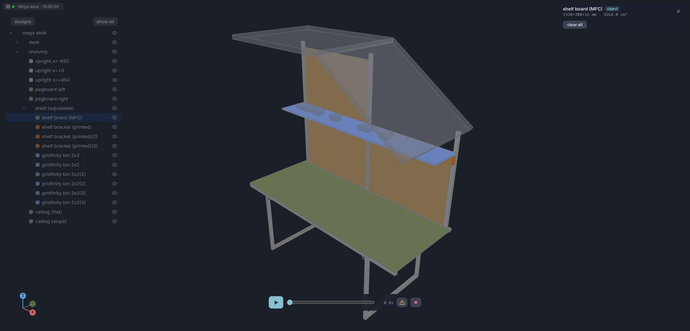
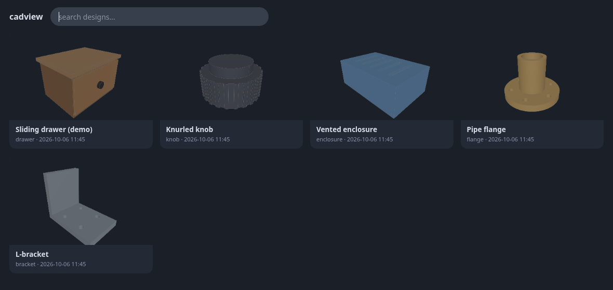
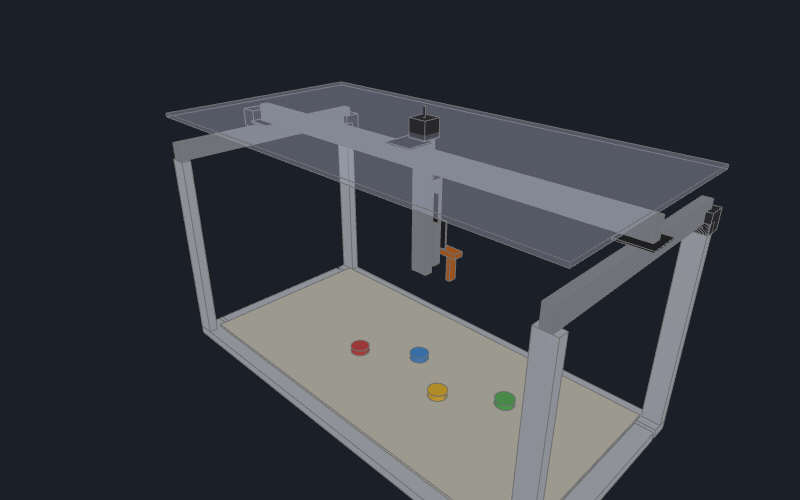

# cadview

Live browser viewer for [build123d](https://github.com/gumyr/build123d) /
CadQuery — a drop-in `show()` for OCP CAD Viewer / ocp_vscode users.

<table><tr>
<td width="50%"></td>
<td width="50%"></td>
</tr></table>

Same call, plus:

- **Persistent** — scenes live on the server with revision history;
  reopen a browser anytime, nothing to re-run
- **Faster** — ~3× quicker scene builds; keeps rendering in background
  windows; `quality="preview"` while iterating
- **Animations** — named clips from keyframe tracks, collision-checked
  during playback, ⏺ records to video
- **Agent-native** — Claude Code reads your selection and part positions,
  verifies animations headlessly
- **Multi-scene, multi-device** — every design on one server with a
  searchable thumbnail gallery, live on desktop and phone

## Install

```bash
git clone https://github.com/bjsi/cadview && cd cadview
pip install -e . build123d
python -m cadview.server            # http://127.0.0.1:3941
```

## Use

```python
from cadview import show            # was: from ocp_vscode import show
show(model)                         # nested Compound labels/colors -> part tree
```

Open `http://127.0.0.1:3941/<project>` (`<project>` = the directory your
script ran from). Click parts or faces to select — alt-click for the whole
part, two selections show the distance between them, double-click finds a
part in the tree, ⏺ records the playing clip to video.

Try it without installing: **[bjsi.github.io/cadview](https://bjsi.github.io/cadview/)** —
or locally: `python examples/mega_desk.py` (a 2 m workbench with shelving,
~50 parts in groups) and `python examples/gantry.py` (an XY gantry with a
stacked Z and gripper, animated) → `http://127.0.0.1:3941/` lists them;
`examples/demo.py` is the minimal one, `examples/parts.py` fills the gallery.

## Animate



```python
PICK = [("Y stage",    "ty", [0, 0.5, 2.0, 5.5, 7.0], [0, 0, -125, -125, -35]),
        ("X carriage", "tx", [0, 0.5, 2.0, 5.5, 7.0], [0, 0,  120,  120, 300]),
        ("Z1 stage",   "tz", [0, 2.0, 3.0, 4.5, 5.5], [0, 0, -150, -150,   0]),
        ("finger left", "tx", [0, 3.8, 4.2], [0, 0, 12])]
show(build(), animation=[{"name": "pick & place", "tracks": PICK}])
```

A track is `(selector, action, times, values)`: selectors match part
labels, actions are `tx/ty/tz` (mm), `rx/ry/rz` (degrees about the node's
own origin), `vis` (show/hide) and `q`; tracks on the same node add
together, and a node carries its children — the gripper rides Z2, Z2 rides
Z1, Z1 rides the X carriage. Clips get a dropdown; a clip's `chapters`
(`[{"t": 4.0, "name": "feeder"}, …]`) become ticks on the scrub bar — the
current one is named next to the time, a click jumps there, a chapter's
optional `"camera": {"focus": part, "view": …, "zoom": …}` is posed when it
starts, and `cadview_snapshot(chapter="feeder")` shoots it; ⚠ toggles the
animated collision check. The gif is a real lab gantry (266 parts, its source lives
in its own repo) driven by exactly such tracks on its carriages, Z stages,
gripper fingers and the ring; `examples/gantry.py` is a simplified machine
you can run, `examples/demo.py` a one-track drawer. Agents (or you) can fetch every
part's world bbox from `GET /api/parts` and verify tracks headlessly with
`POST /api/clearance`; `cadview.Timeline` builds tracks phase-by-phase if
the arrays get unwieldy — see `docs/DETAILS.md`.

## With Claude Code

In the desktop app, make the viewer your project's preview server — the
Browser pane then starts it and opens the gallery by itself
(`.claude/launch.json`; `cadview` is idempotent on its port, so a viewer
already running in a terminal is reused):

```json
{ "version": "0.0.1", "configurations": [
    { "name": "cadview", "runtimeExecutable": "python", "runtimeArgs": ["-m", "cadview.server"],
      "port": 3941, "autoPort": false } ] }
```

Add the selection tool to your project's `.mcp.json`:

```json
{ "mcpServers": { "cadview": {
    "command": "python", "args": ["-m", "cadview.mcp"] } } }
```

Select geometry on the page, then just say "make these 5 mm taller" — the
agent's `cadview_selection` tool returns exactly what you picked, with
measurements. Agents without MCP can `GET /api/selection?name=<project>`.

The Browser pane is the person's: an agent should not navigate it to check
its own work. `cadview_snapshot` (or `GET /api/snapshot?name=<project>
&view=top&focus=<part>&hide=<parts>&t=<s>`) returns a PNG rendered in a
hidden frame of whatever cadview page is open — any view, any part framed,
any animation time — and the page the person is looking at never changes.
`GET /api/parts?name=<project>` gives positions without a picture.

## Boards

`cadview.pcb` lays a PCB out from the CAD: `Board(face, layers=2|4)` takes
the outline, holes and cutouts (arcs, beziers, circles) off a build123d
Face, `kicad_footprint()` reads KiCad's own libraries, `place()` (either
side) / `net()` / `keepout()` / `pour()` describe the board, and out come
a `.kicad_pcb` + schematic an agent can edit and `kicad-cli` can check and
export (`tools/pcb/kicad_export.sh`), tscircuit Circuit JSON for its router
(`tools/pcb/export.mjs`), JLCPCB BOM + CPL, and `solid()` — the populated
board back in the assembly. Proven against eighteen open-source KiCad boards
(`tests/pcb`). `pip install cadview[pcb]`.

## Review pages

`python -m cadview.bake --single-file out/` writes one self-contained
`<scene>.html` per scene — viewer, three.js and the scene inlined; opens
from a file or an attachment with full orbit / part tree / hide / measure /
animation. `--changed-vs cadview-scenes.tar.gz` keeps only scenes whose
geometry differs from a bundle (what a PR changed). Without `--single-file`
it bakes a static multi-scene site (the demo site is one).

## More

`docs/DETAILS.md` — revision history, re-run/watch of pushing modules,
tuning, deployment knobs.
