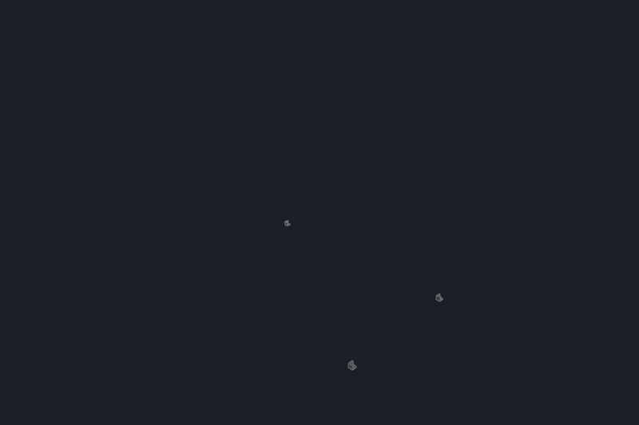
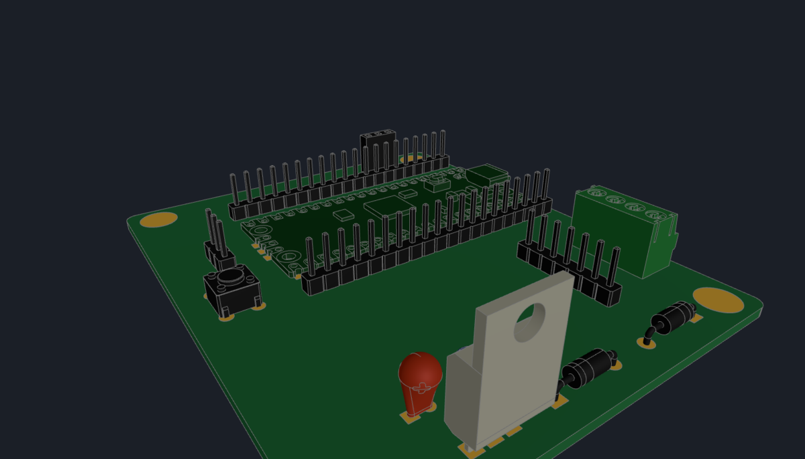

# openworkshop

Live browser viewer for [build123d](https://github.com/gumyr/build123d) /
CadQuery — a drop-in `show()` for OCP CAD Viewer / ocp_vscode users, with
animation, a gallery, an agent's eyes and a board layout layer.

<table><tr>
<td width="50%"></td>
<td width="50%"></td>
</tr></table>

- **Persistent** — scenes live on the server with revision history; reopen
  a browser anytime, nothing to re-run
- **Faster** — ~3× quicker scene builds, keeps rendering in background
  windows, `quality="preview"` while iterating
- **Animations** — named clips from keyframe tracks, chapters on the scrub
  bar, collision-checked, ⏺ records to video
- **Agent-native** — Claude Code reads your selection, takes its own
  snapshots, verifies animations headlessly
- **Multi-scene, multi-device** — every design on one server, a searchable
  thumbnail gallery, live on desktop and phone
- **Boards** — lay a PCB out from the CAD: KiCad project, autorouting,
  JLCPCB files, the populated board back in the assembly

## Install

```bash
git clone https://github.com/bjsi/openworkshop && cd openworkshop
pip install -e . build123d
python -m openworkshop.server            # http://127.0.0.1:3941
```

## Use

```python
from openworkshop import show       # was: from ocp_vscode import show
show(model)                         # nested Compound labels/colors -> part tree
```

Open `http://127.0.0.1:3941/<project>` (`<project>` = the directory your
script ran from). Click parts or faces to select, alt-click for the whole
part, two selections measure the distance between them, double-click
finds a part in the tree.

Try it without installing: **[bjsi.github.io/openworkshop](https://bjsi.github.io/openworkshop/)**.
Locally, `python examples/mega_desk.py` (a 2 m workbench, ~50 parts) and
`python examples/gantry.py` (an XY gantry with a stacked Z and gripper)
fill `http://127.0.0.1:3941/`.

## Animate


```python
PICK = [("Y stage",    "ty", [0, 0.5, 2.0, 5.5, 7.0], [0, 0, -125, -125, -35]),
        ("X carriage", "tx", [0, 0.5, 2.0, 5.5, 7.0], [0, 0,  120,  120, 300]),
        ("Z1 stage",   "tz", [0, 2.0, 3.0, 4.5, 5.5], [0, 0, -150, -150,   0]),
        ("finger left", "tx", [0, 3.8, 4.2], [0, 0, 12])]
show(build(), animation=[{"name": "pick & place", "tracks": PICK}])
```

A track is `(selector, action, times, values)`: selectors match part
labels, actions are `tx/ty/tz` (mm), `rx/ry/rz` (degrees), `vis` and `q`;
a node carries its children, so the gripper rides Z2, Z2 rides Z1, Z1
rides the X carriage. The gif is a real 266-part lab gantry driven by
tracks like these; `examples/gantry.py` is a simplified one you can run.



```python
tl = Timeline()
for name, parts in [("legs", LEGS), ("frame", FRAME), ("top", ["MDF top"]), ("shelf", ["shelf (adjustable)"])]:
    tl.chapter(name, t, camera={"focus": parts[0], "view": "iso"})
    for i, p in enumerate(parts):
        tl.hide(p, start=0, until=t + i * 0.25)
        tl.move(p, "tz", 400, start=0, dur=0); tl.move(p, "tz", 0, start=t + i * 0.25, dur=0.8)
    t += len(parts) * 0.25 + 1
show(build(), animation=[tl.clip("assembly")])
```

`Timeline` builds tracks phase by phase; chapters become ticks on the
scrub bar — the current one is named above it, a click jumps there, a
chapter's camera is posed as it starts. ⚠ toggles the animated collision
check. Agents fetch every part's world bbox from `GET /api/parts` and
verify tracks headlessly with `POST /api/clearance` (`examples/mega_desk.py`
has the full clip).

## With Claude Code

Make the viewer the project's preview server (`.claude/launch.json`) and
add the selection tool to `.mcp.json`:

```json
{ "version": "0.0.1", "configurations": [
    { "name": "openworkshop", "runtimeExecutable": "python", "runtimeArgs": ["-m", "openworkshop.server"],
      "port": 3941, "autoPort": false } ] }
```

```json
{ "mcpServers": { "openworkshop": { "command": "python", "args": ["-m", "openworkshop.mcp"] } } }
```

Select geometry on the page and say "make these 5 mm taller": the agent's
`openworkshop_selection` tool returns exactly what you picked, with
measurements. `openworkshop_snapshot` (or `GET /api/snapshot?name=<project>
&view=top&focus=<part>&t=<s>`) returns a PNG rendered in a hidden frame
of whatever openworkshop page is open, so the agent checks its own work and
the page you are looking at never changes.

## Boards



```python
from openworkshop.pcb import Board, kicad_footprint

b = Board(outline_face, thickness=1.6)               # outline + holes straight off a build123d Face
for ref, (lib, name), at, rot, value in PARTS:        # ("U1", ("Package_TO_SOT_THT", "TO-220-3_Vertical"), (77.5, 22), 270, "LM7805")
    b.place(kicad_footprint(lib, name), ref, at, rot=rot, value=value)
for net, pins in NETS.items():                        # "GND": [("A1", "3"), ("C1", "2"), ...]
    b.net(net, *pins)
b.pour("GND", "B.Cu")
b.write_kicad("out", "board")                         # .kicad_pcb + .kicad_sch + .kicad_pro + netlist
b.write_jlc("out")                                    # bom.csv + cpl.csv for JLCPCB assembly
show(enclosure + b.solid())                           # the populated board back in the assembly
```

The outline and cutouts come off a build123d Face, footprints and symbols
from KiCad's own libraries, parts on either side of a 2- or 4-layer board
with nets, pours, keepouts and silkscreen. `kicad-cli` checks and exports
the result (`tools/pcb/kicad_export.sh`), Freerouting routes it
(`tools/pcb/freeroute.py board.kicad_pcb --drc`; tscircuit via
`tools/pcb/export.mjs`), and `solid()` puts the populated board back in
the enclosure while you design both. The picture is
`examples/stepper_board.py`, John McAleely's
[stepper playground](https://github.com/jhmcaleely/stepper-playground) (MIT)
re-expressed as seventeen placements and 41 nets; the layer is proven
Gerber for Gerber against 27 open-source KiCad boards (`tests/pcb`).
`pip install openworkshop[pcb]`; needs KiCad's libraries on disk
(`KICAD_FOOTPRINTS`, `KICAD_SYMBOLS`, `KICAD_3DMODELS`).

## Review pages

`python -m openworkshop.bake --single-file out/` writes one self-contained
`<scene>.html` per scene with full orbit, part tree, measure and
animation — opens from a file or an attachment. `--changed-vs
openworkshop-scenes.tar.gz` keeps only the scenes a PR changed; without
`--single-file` it bakes a static multi-scene site (the demo site is one).

## More

`docs/DETAILS.md` — revision history, re-run/watch of pushing modules,
tuning, deployment knobs.
